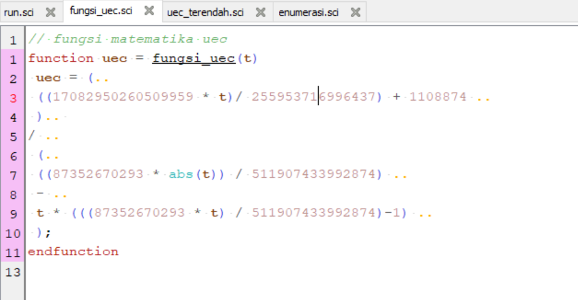
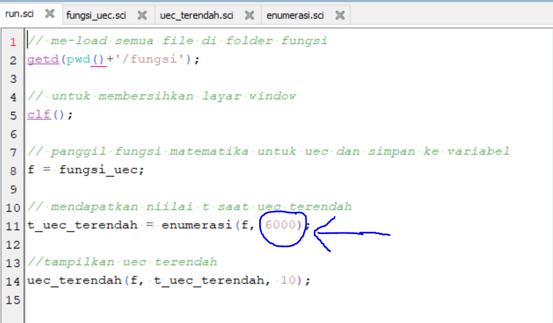
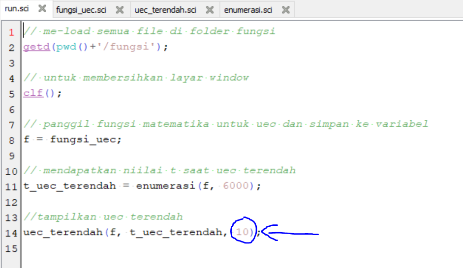
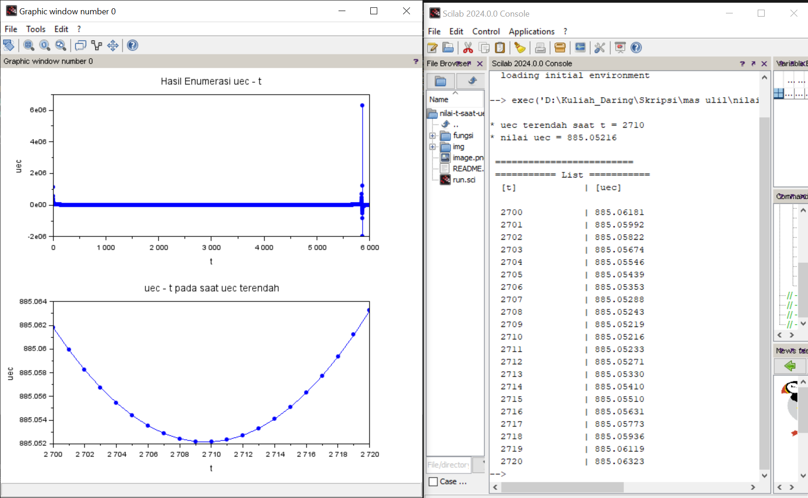

# Program untuk menemukan t saat UEC terendah

Program berikut dapat digunakan untuk menemukan nilai t dan uec terendah dengan memasukkan fungsi matematis dan jumlah enumerasi yang dilakukan.
## Installation

```bash
  git clone https://github.com/Sch39/nilai-t-saat-uec-terendah-dengan-scilab.git
  cd nilai-t-saat-uec-terendah-dengan-scilab
```

## Documentation

### Menjalankan program
Pastikan Scilab telah terinstall, clone proeject kemudian clik 2x pada file run.sci maka program akan otomatis ter-load.

### Meengubah fungsi matematik
Untuk mengubah fungsi matematik, silahkan buka file fungsi_uec.sci, dan masukan fungsi anda pada deklarasi variabel uec.


### Mengubah jumlah enumerasi keseluruhan (grafik atas)
Untuk mengubah jumlah enumerasi, lakukan pada file run.sci, kemudian ubah parameter terakhir saat memanggil fungsi enumerasi (default 6000).


### Mengubah jumlah t ditampilkan saat uec terendah ditemukan (grafik bawah)
Untuk mengubah jumlah enumerasi, lakukan pada file run.sci, kemudian ubah parameter terakhir saat memanggil fungsi uec_terendah (default 10).


## Demo

